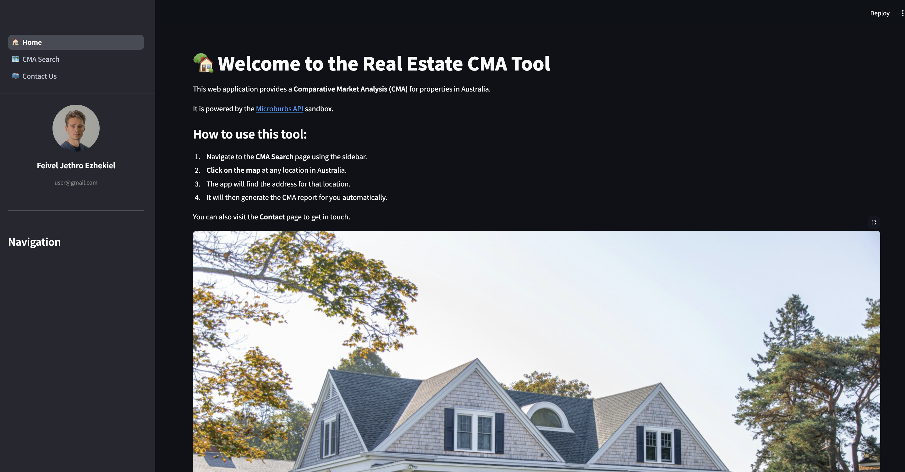
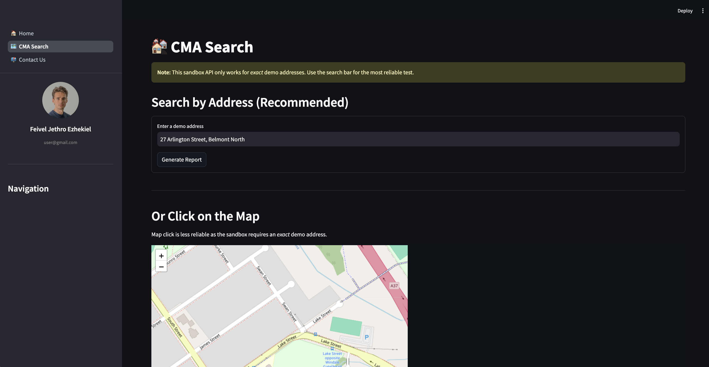
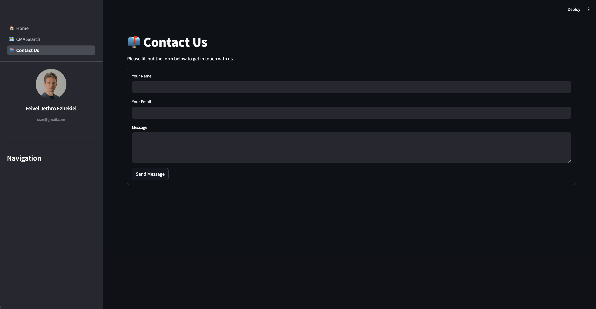

# Real Estate CMA Streamlit App

> Your Smart CMA Tool for Australian Property Analysis

This is a multi-page Streamlit web application built to provide a Comparative Market Analysis (CMA) for properties in Australia. It connects to the Microburbs Sandbox API to fetch property data. Users can either search by a specific address (recommended) or use an interactive map to select a location.

---

## 📸 Demo

| Home Page | CMA Search Page | Contact Page |
| :---: | :---: | :---: |
|  |  |  |

---

## 🚀 Key Features

* **Multi-Page Navigation:** A clean sidebar separates the Home, CMA Search, and Contact pages.
* **Dynamic User Profile:** Shows mock user info in the sidebar.
* **Dual Search Methods:**
    * **Address Search:** A reliable search bar to get reports for specific addresses.
    * **Map Search:** An interactive Folium (Leaflet) map where users can click any location to generate a report.
* **Live API Integration:** Connects to the Microburbs API to perform reverse geocoding and fetch CMA reports.
* **Modular Code:** All API calls and helper functions are separated into `cma_utils.py` for a clean codebase.
* **Contact Form:** A simple, functional contact page.

---

## 🛠️ Tech Stack

* **Python**
* **Streamlit** (for the web app framework)
* **Pandas** (for data manipulation)
* **Requests** (for making API calls)
* **Folium** & **streamlit-folium** (for the interactive map)

---

## Getting Started

### 1. Clone the Repository
```bash
git clone [https://github.com/jethrosta/Suburb-API-Quiz.git](https://github.com/jethrosta/Suburb-API-Quiz.git)
cd Suburb-API-Quiz
